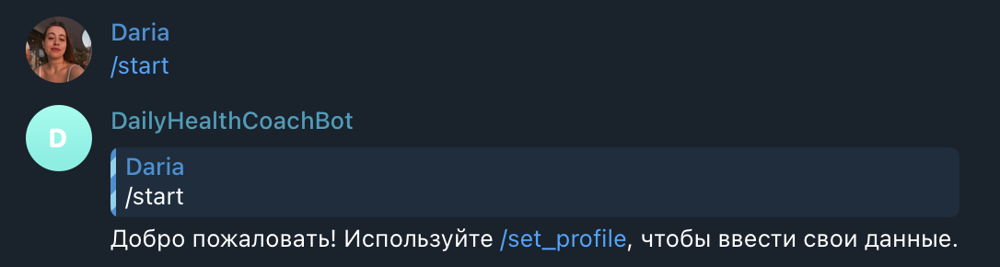
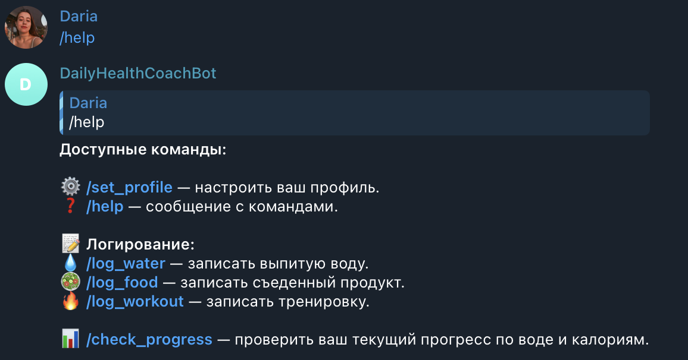
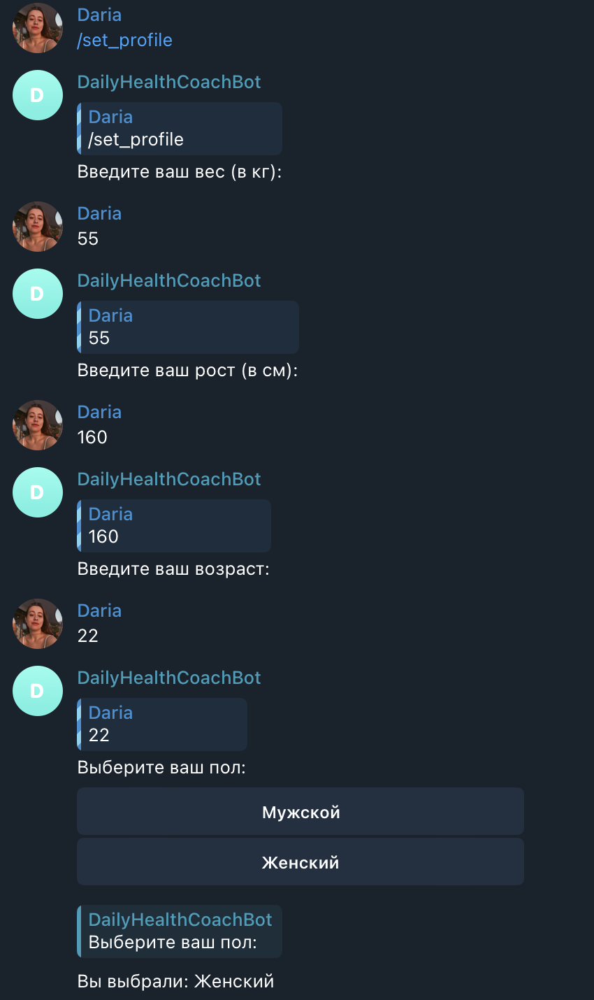
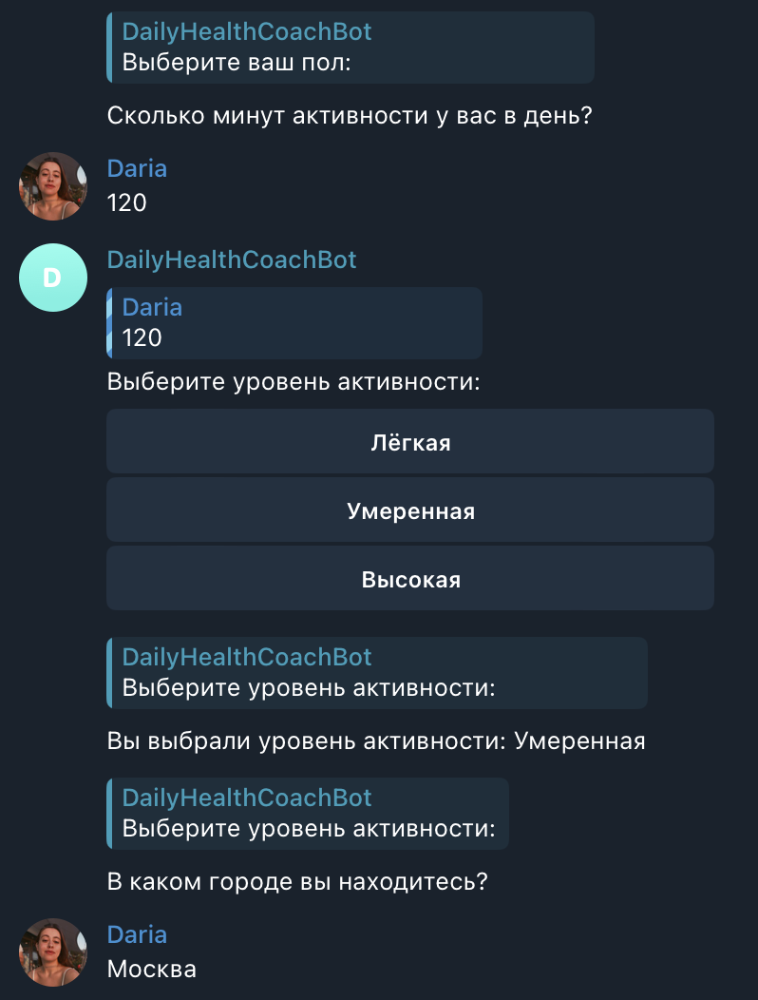
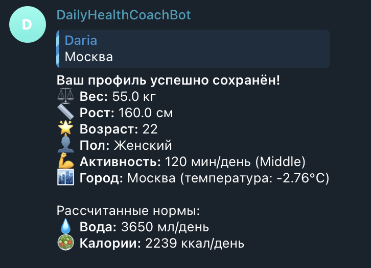
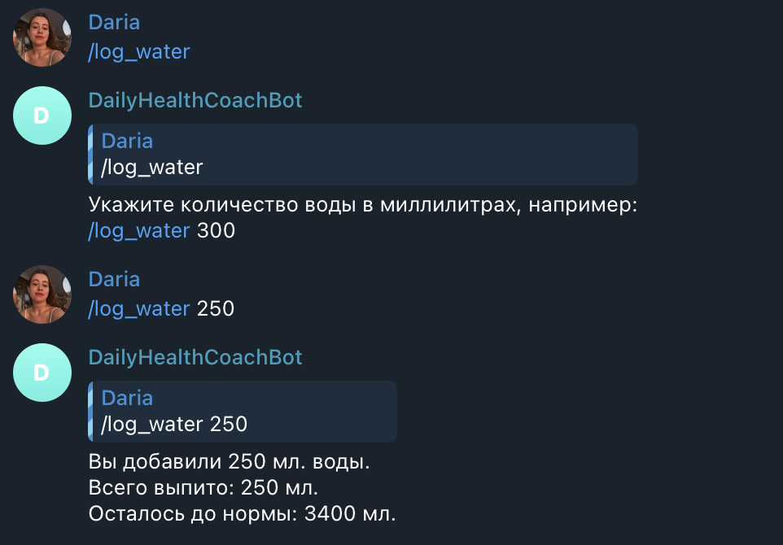
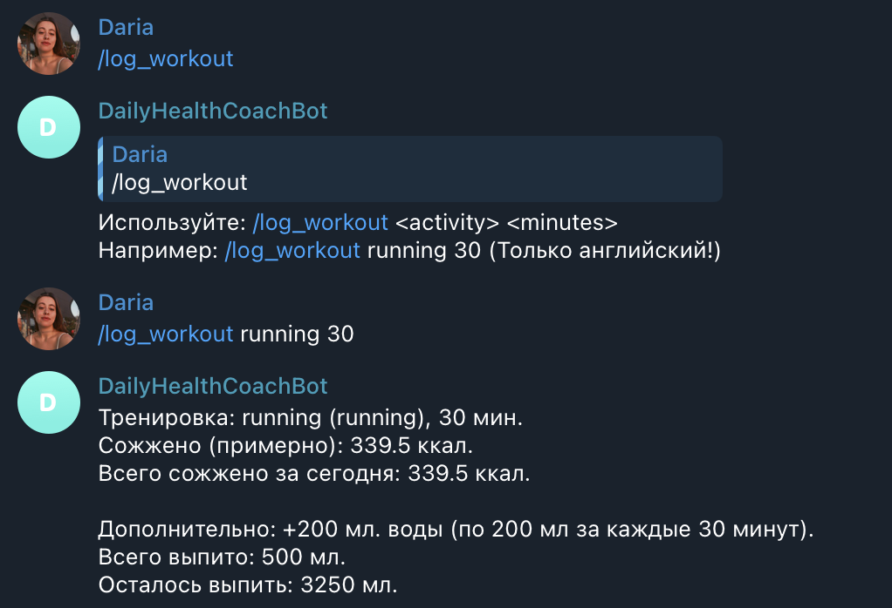
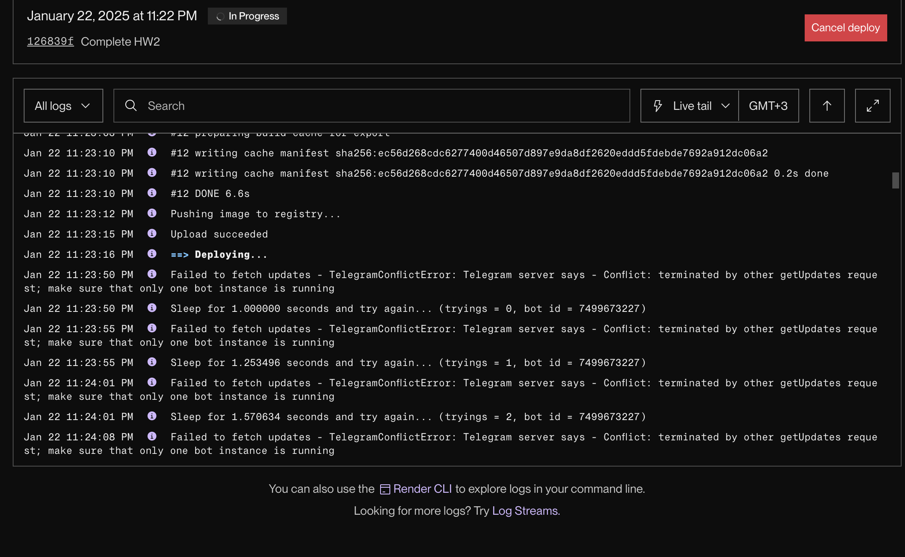
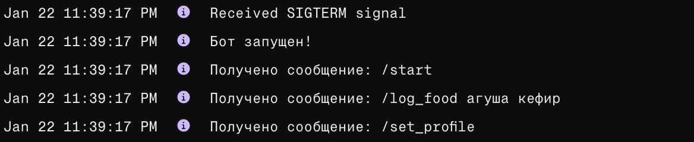

# Homework 2 | Telegram Bot

>@DailyHealthCoachBot - ник бота в тг.

## Основные команды

- **⚙️ Настройка профиля:**
  - `/set_profile` — настройте ваш профиль, указав вес, рост, возраст, пол, уровень активности и город проживания.

- **❓ Помощь:**
  - `/help` — покажет список всех доступных команд.

- **📝 Логирование:**
  - `/log_water <количество>` — записать выпитую воду (в мл).
  - `/log_food <продукт>` — записать съеденную пищу.
  - `/log_workout <активность> <время>` — записать тренировку (только на английском).
  
- **📊 Прогресс:**
  - `/check_progress` — проверить ваш текущий прогресс по воде и калориям.

## Как начать?

1. Запустите бота и введите команду `/start`.
2. Настройте профиль с помощью команды `/set_profile`.
3. После настройки профиля начните отслеживать ваш прогресс с помощью команд логирования.

## Пример использования

1. `/start`

2. `/help`

3. `/set_profile`

4. `/log_water <количество>`

5. `/log_food <продукт>`

6. `/log_workout <активность> <время>`

7. `/check_progress`

Скриншот деплоя проекта:

